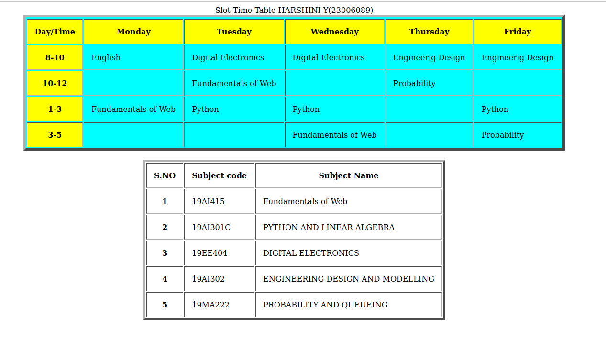

# Experiment_Time_Table

## AIM
To Write a html webpage page to display your timetable.

# ALGORITHM
### STEP 1
create a simple table using table tag
### STEP 2
Add header row using th tag
### STEP 3
Add your timetable
### STEP 4
Execute the program

# CODE
```<html>
     <title>Time Table</title>
     <body>
     <center>
           <table border="5" bgcolor="cyan" cell spacing="10" cellpadding="15">
          
           <caption>Slot Time Table-SANTHIYA R(2300523)</caption>
           
<tr>
    <TR bgcolor="Yellow">
    <th>Day/Time</th>
    <th>Monday</th>
    <th>Tuesday</th>
    <th>Wednesday</th>
    <th>Thursday</th>
    <th>Friday</th>
    </TR>
</tr>
<tr>
   <th bgcolor="yellow">8-10</th>
   <td>Python</td>
   <td>Digital Electronics</td>
   <td>Digital Electronics</td>
   <td>Engineerig Design</td>
   <td>Engineerig Design</td>
</tr>
<tr>
   <th bgcolor="yellow">10-12</th>
   <td></td>
   <td>Fundamentals of Web</td>
   <td></td>
   <td>Probability</td>
   <td></td>
</tr>
<tr>
    <th bgcolor="yellow">1-3</th>
   <td>Fundamentals of Web</td>
   <td>Python</td>
   <td>Python</td>
   <td></td>
   <td>Python</td>
</tr>
<tr>
   <th bgcolor="yellow">3-5</th>
   <td></td>
   <td></td>
   <td>Fundamentals of Web</td>
   <td></td>
   <td>Probability</td>
</tr>
</table>
<br>
<table>
 <table border="5" cell spacing="10" cellpadding="15">
<tr>
   <th>S.NO</th>
   <th>Subject code</th>
   <th>Subject Name</th>
</tr>
<tr>
   <th>1</th>
   <td>19AI415</td>
   <td>Fundamentals of Web</td>
</tr>
<tr>
   <th>2</th>
   <td>19AI301C</td>
   <td>PYTHON AND LINEAR ALGEBRA</td>
</tr>
<tr>
   <th>3</th>
   <td>19EE404</td>
   <td>DIGITAL ELECTRONICS</td>
</tr>
<tr>
   <th>4</th>
   <td>19AI302</td>
   <td>ENGINEERING DESIGN AND MODELLING</td>
</tr>
<tr>
   <th>5</th>
   <td>19MA222</td>
   <td>PROBABILITY AND QUEUEING</td>
</tr>
</table>
</body>
</center>
</html>

```
# OUPUT


# RESULT
thus the program excecuted successfully